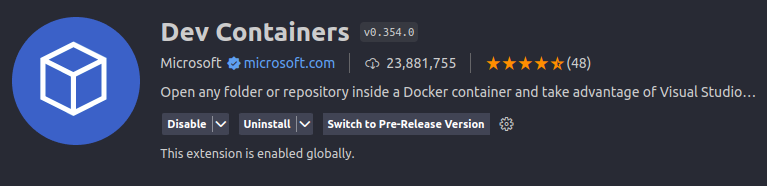
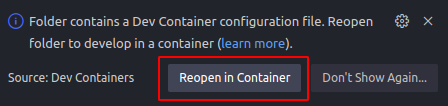
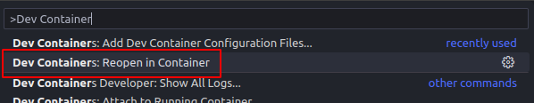

# Deploy
**Link:** https://backend-fairshare.onrender.com

Hay una rama `test` en la cual se va a deployar automaticamente cada vez que sufra cambios. 

La idea es no pushear directamente a esa rama, sino hacer un merge request de `main` a `test` cada vez que completemos alguna funcionalidad para que pueda testear el PO.

# Ambiente de desarrollo

## Requisitos:
- Tener docker instalado.
- En VSCode descargar la extensión **Dev Containers**.
    
    

**Dev Containers** agarra el archivo de configuración `/.devcontainer/devcontainer.json`, levanta la base de datos y el Dockerfile con el `/.devcontainer/docker-compose.yml` y hace que VSCode se abra dentro del contenedor para no tener que instalar ninguna otra dependencia en la computadora.

## Activar DevContainers
### Notificacion
- Puede que al abrir la carpeta del proyecto salta este mensaje y hacer click en "Reopen in Container"
    
    
- Listo

### Alternativa
- Apretar `F1`
- Buscar *Dev Container* y hacer click en "Reopen in Container"
    
    
- Listo

> **Nota**: La primera vez tarda mucho en cargar, eso pasa porque esta descargando la imágen docker.

La proxima vez que se abra el proyecto, esto se hará de forma automática. Sino repetir los pasos anteriores.

## Variables de entorno

- Crear el archivo `.env` que no debe ser pusheado al repo porque rompe el deploy (igual fue agregado al `.gitignore`).
- El archivo debe estar en el path `src/.env`
- El contenido del `.env` debe contener la dirección local de la base de datos:

```
SQLALCHEMY_DATABASE_URL = "postgresql://postgres:postgres@db:5432/postgres"
```

## Levantar app

- Correr el script `start_dev.sh`
```shell
./start_dev.sh
```
- El servicio va a correr en `http://0.0.0.0:80/docs`.

> **Nota**: No hace falta tirarlo abajo y volver a correr cada vez que hagamos un cambio porque tiene el flag `--reload` que detecta cuando hay un cambio y recarga la página.

```shell
vscode ➜ /workspaces/backend (main) $ ./start_dev.sh 
INFO:     Will watch for changes in these directories: ['/workspaces/backend']
INFO:     Uvicorn running on http://0.0.0.0:80 (Press CTRL+C to quit)
INFO:     Started reloader process [876] using WatchFiles
INFO:     Started server process [878]
INFO:     Waiting for application startup.
INFO:     Application startup complete.
```

- Para ver la documentación se puede acceder a http://0.0.0.0:80/docs